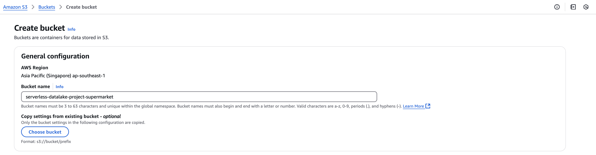
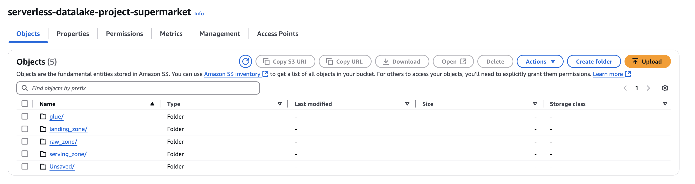
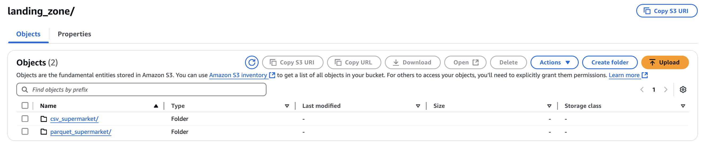
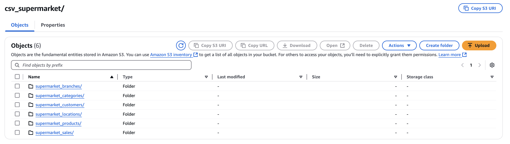

# S3 Bucket Setup for Serverless Datalake Project

This guide explains how to set up an S3 bucket for the `serverless-datalake-project-supermarket` project.

## Step 1: Create S3 Bucket
- Bucket name: `serverless-datalake-project-supermarket`

## Step 2: Create Main Folders
Inside the bucket, create the following folders:
- `landing_zone`
- `raw_zone`
- `serving_zone`

## Step 3: Create Subfolders in `landing_zone`
Inside the `landing_zone` folder, create these subfolders:
- `csv_supermarket`
  - This is the area to store CSV files.
- `parquet_supermarket`
  - This is the area to store Parquet files (converted from CSV) before use.

## Step 4: Create Subfolders for Tables in `csv_supermarket`
Inside the `csv_supermarket` folder, create subfolders for each table and place the CSV files as follows:
- `supermarket_branches`
  - File: `supermarket_branches.csv`
- `supermarket_categories`
  - File: `supermarket_categories.csv`
- `supermarket_customers`
  - File: `supermarket_customers.csv`
- `supermarket_locations`
  - File: `supermarket_locations.csv`
- `supermarket_products`
  - File: `supermarket_products.csv`
- `supermarket_sales`
  - File: `supermarket_sales.csv`

**Note**: In this project, upload the prepared folders and files directly into the `csv_supermarket` folder.

