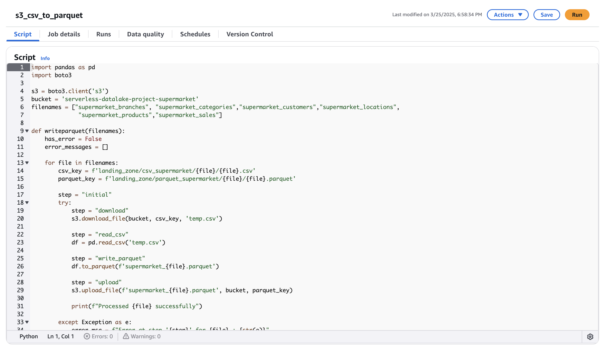

# Glue Python Shell Setup

This guide explains how to set up a Glue Python Shell job

## Step 1: Choose Script Editor
- Go to the AWS Glue console and select the **Script Editor**

## Step 2: Select Engine and Create Script
- Choose **Python Shell** as the engine
- Click **Create Script** to start writing your code

## Step 3: Add Python Code
- Paste your Python code into the editor
- No need to install libraries manually (Glue handles this)

## Step 4: Name the Glue Job
- Give your Glue job a clear and unique name

## Step 5: Add IAM Role Permissions
- Attach an IAM role to the Glue job
- Make sure the role has the correct permissions for the tasks you want to perform
- **Important**: If the permissions are not set correctly, the job will fail due to lack of access

## Step 6: Save and Run
- Click **Save** to save your job
- Click **Run** to execute the job

**Note**: Double-check the IAM permissions before running to avoid errors