# AWS Serverless Datalake Project

This project demonstrates a serverless datalake on AWS using mock supermarket data, simulating daily S3 uploads by a team. It focuses on initial setup and daily updates for the `supermarket_sales` table (other tables remain static for simplicity), incorporating manual AWS UI steps, automation, and star schema data modeling. The pipeline extends to data visualization with AWS QuickSight, delivering actionable insights like branch sales rankings, best-selling products, and top customer spending

Key AWS services power this datalake, optimizing costs and performance with Parquet conversion and partitioning. For example, a 636.7 MB CSV shrinks to 91.3 MB (**85.66% storage reduction**), while partitioning cuts query data scanned by **99.3%** and run time by **86.64%**

## Tools Used
- **S3**: Storage for the datalake
- **IAM Role Permissions**: Permissions for AWS services
- **Glue**:
  - Data Catalog: Metadata management
  - ETL Job: Data processing
  - Python Shell: Automation scripts
  - Crawler: Auto-generates DDL and tables
- **Athena**: Query engine
- **Step Functions**: Workflow management
- **CloudWatch**: Log monitoring
- **Amazon EventBridge Scheduler**: Schedules automated runs
- **QuickSight**: Data visualization for creating interactive dashboards
- **Languages**:
  - Python: Scripting for Glue jobs and automation
  - SQL: Querying and data modeling in Athena
- **Libraries**:
  - Pandas: Data manipulation in Python scripts
  - Boto3: AWS service interactions in Python

## AWS Serverless Datalake Architecture Overview
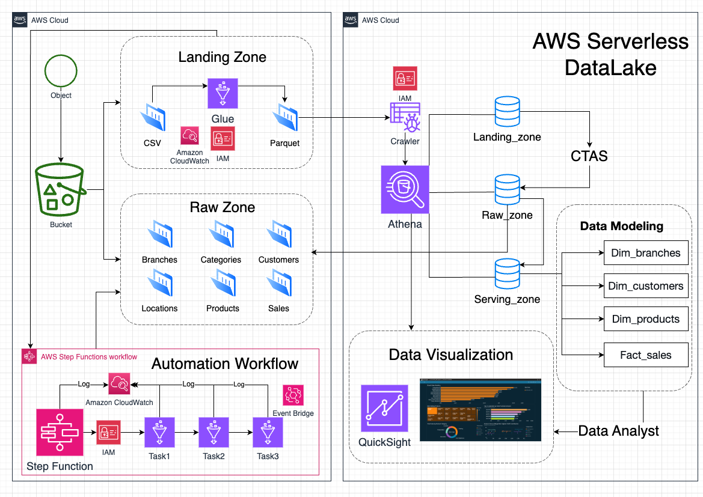

## ER Diagram
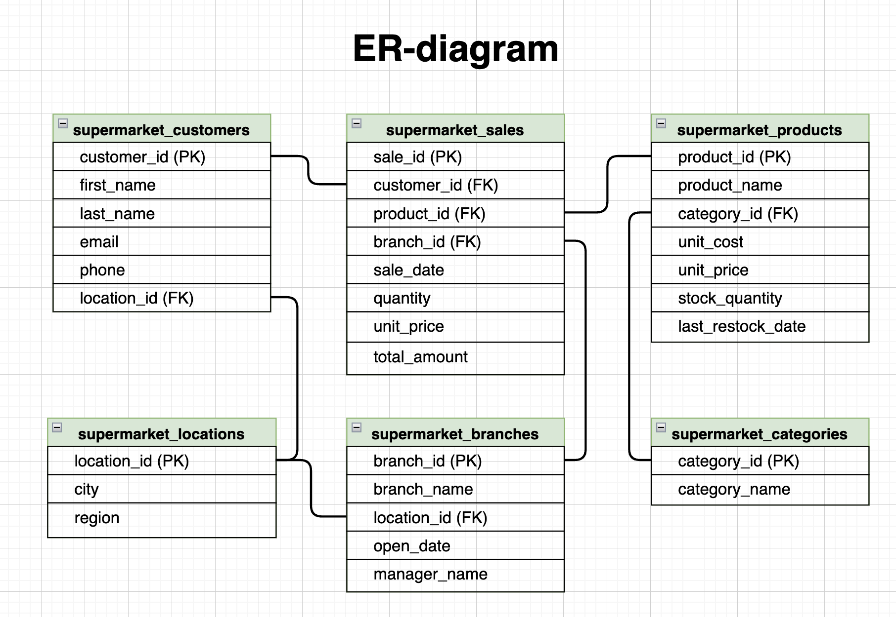

## Steps

### Step 1: Import Data to S3
- Set up the S3 bucket and prepare data.
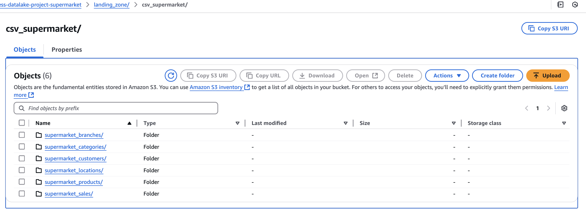
- See details in [S3_Bucket_Setup_for_Serverless_Datalake.md](1_import_data_to_S3/S3_Bucket_Setup_for_Serverless_Datalake.md)

### Step 2: S3 CSV to Parquet
- Convert CSV files in `landing_zone` from folder `csv_supermarket` to `parquet_supermarket` 
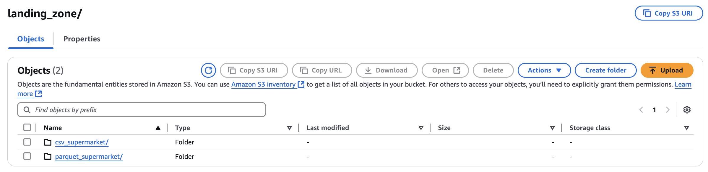
- Using a Glue job with Python script [S3_csv_to_parquet.py](2_S3_csv_to_parquet/S3_csv_to_parquet_try_error_continue.py)
- Glue Python Shell setup instructions: [Glue_Python_Shell_Setup.md](2_S3_csv_to_parquet/Glue_Python_Shell_Setup.md)  
- **Note**: While Glue Crawler can work directly with CSV files without converting to Parquet, experience shows that Crawler may generate incorrect DDL schemas or column names for some tables. This happens because CSV files do not store schema or data type information. In contrast, Parquet files include schema and data type details, allowing Crawler to process them more accurately.
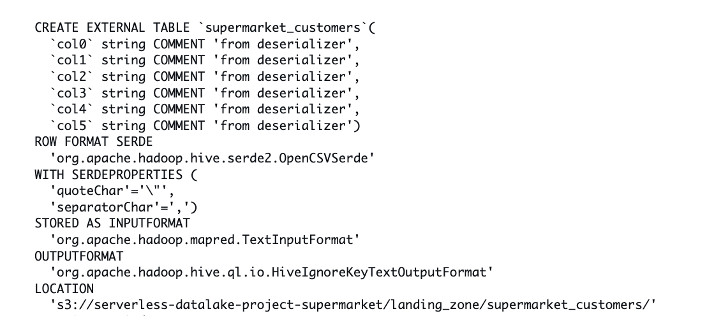

### Step 3: Create Athena Database
- Create databases in Athena to store tables for different zones.  
- **Setting Athena**:  
  - Go to **Manage Settings** in Athena.  
  - Set the S3 path for storing query results: `s3://serverless-datalake-project-supermarket/`   
  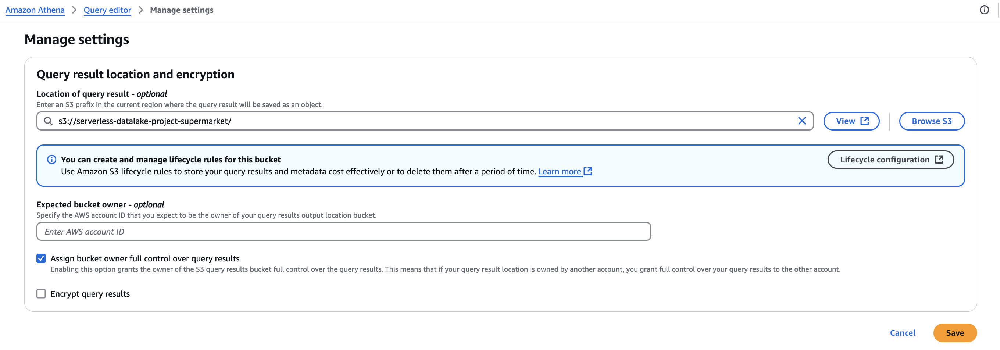 
- Run the SQL query from [Create_database.sql](3_Create_Athena_database/Create_database.sql)

### Step 4: Generate DDL and Tables with Glue Crawler
- Use Glue Crawler to scan `landing_zone/parquet_supermarket` and auto-create DDL and tables in the Athena database 
- Setup guide: [Setup_Glue_Crawler.md](3_Create_Athena_database/Setup_Glue_Crawler.md)  
- **Result**: Glue Crawler automatically generates tables and DDL
  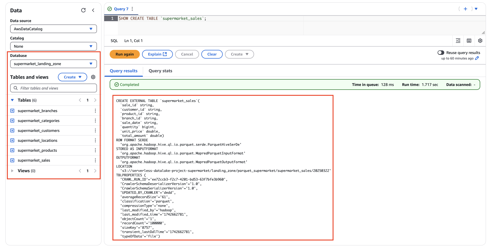  
- Once completed, data in S3 becomes queryable through Athena
  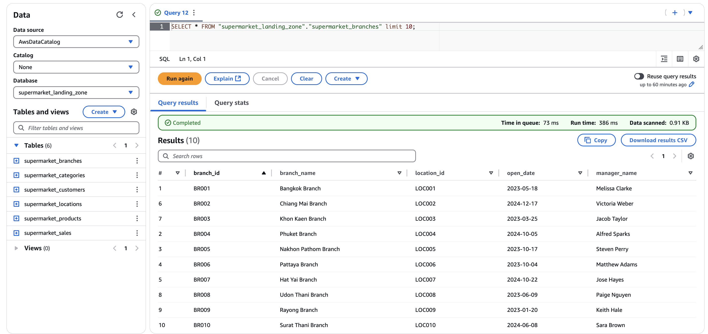  
- **Note**: After this step, you can query and transform data in `landing_zone` before transferring it to `raw_zone`

### Step 5: Create Tables in Raw Zone
- Manually create tables in `raw_zone` for the initial setup (one-time task) using SQL queries like [CREATE_raw_supermarket_sales.sql](4_Create_table_raw_zone/CREATE_raw_supermarket_sales.sql) for all tables
- **Example**: Create the `supermarket_sales` table with partitions:

- Avoid running Glue Crawler multiple times to save costs  
- **Optional**: For large projects, automate SQL generation using the Python script 
[gen_sql_file_create_table_raw_zone](4_Create_table_raw_zone/gen_sql_file_with_try_error.py) , which generates SQL based on the DDL from `landing_zone`
- **Note**: This step creates the table structure to prepare for data loading. Querying at this point will not return data yet, as the data will be added in the next step via CTAS

### Step 6: CTAS to Write Files to S3
- Use a CTAS (Create Table As Select) query from [CTAS_supermarket_raw_sales.sql](4_Create_table_raw_zone/CTAS_supermarket_raw_sales.sql) to create a temporary table, write Parquet files to `raw_zone`, and add partitions using data from `landing_zone`  
- Drop the temporary table after completion to prepare for the next run.
- **Process for All Tables**: Apply the following steps to each table:
  - For static tables (e.g., `supermarket_branches`, `supermarket_categories`, `supermarket_customers`, `supermarket_locations`, `supermarket_products`), no partitioning is needed as they are not updated daily  
  - For `supermarket_sales`, include partitioning by `year`, `month`, and `day` as it receives daily updates
- **Example for `supermarket_sales`**:  
  - **Create Temp Table with CTAS**:
  

  - **Add Partition to Raw Zone Table**:
  

  - **Drop Temp Table**:
  

- Results from running the CTAS query will generate Parquet files in the `raw_zone` of S3, along with the specified partitions
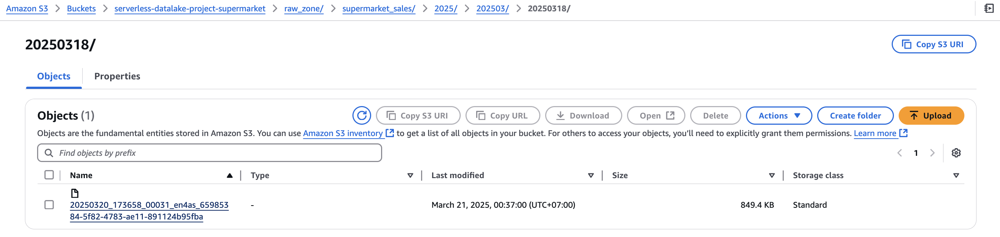

### Step 7: Data Modeling (Fact and Dimension)
- Create views for fact and dimension tables (star schema) in `serving_zone` to support data analysis
- Star schema
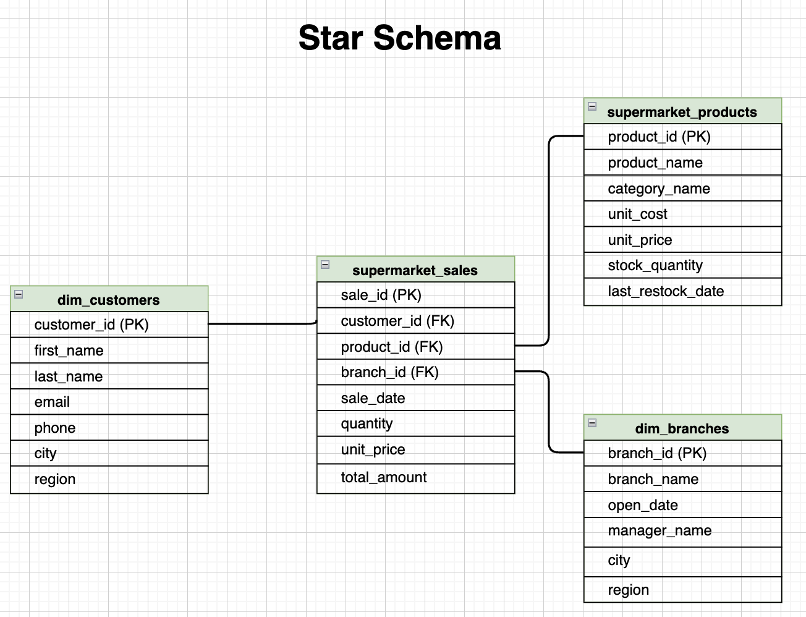
- Files:  
  - [CREATE_VIEW_dim_branches.sql](5_Create_view_fact_and_dimention/CREATE_VIEW_dim_branches.sql)  
  - [CREATE_VIEW_dim_categories.sql](5_Create_view_fact_and_dimention/CREATE_VIEW_dim_categories.sql)  
  - [CREATE_VIEW_dim_customers.sql](5_Create_view_fact_and_dimention/CREATE_VIEW_dim_customers.sql)  
  - [CREATE_VIEW_fact_sales.sql](5_Create_view_fact_and_dimention/CREATE_VIEW_fact_sales.sql)  
- **Example for `vw_fact_sales`**:

- **Note**: The fact table `vw_fact_sales` joins with `supermarket_products` to calculate metrics like profit and margin for analysis.

- Test the star schema by querying the top 5 customers with the highest total purchase amounts on March 23, 2025, using the fact and dimension tables in the `serving_zone`
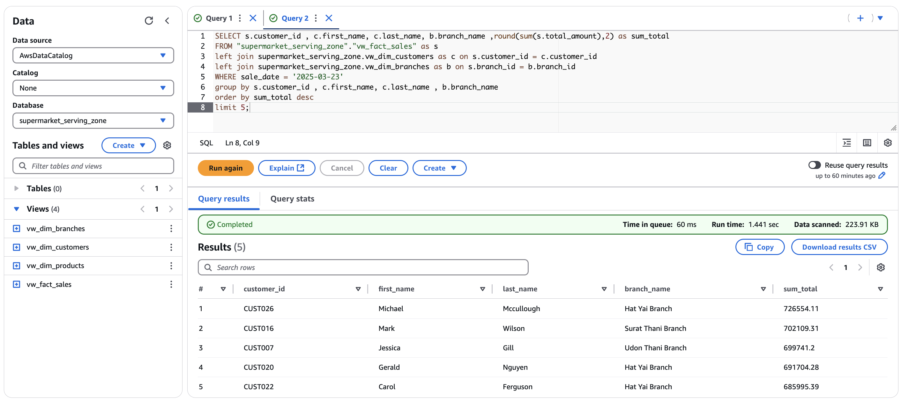

### Step 8: Daily Update for Landing Zone
- Assume new `supermarket_sales` CSV files are uploaded daily to `landing_zone` 
- Convert to Parquet using Glue job with [s3_csv_to_parquet_supermarket_sales.py](6_daily_update_landing_zone/s3_csv_to_parquet_supermarket_sales.py)

- Update Athena to see new files using [daily_landing_supermarket_sales.sql](6_daily_update_landing_zone/daily_landing_supermarket_sales.sql)

- or automate with [daily_landing_supermarket_sales.py](6_daily_update_landing_zone/daily_landing_supermarket_sales.py)

### Step 9: Daily Update for Raw Zone
- Update `raw_zone` using Glue job with [daily_raw_supermarket_sales.py](7_daily_update_raw_zone/daily_raw_supermarket_sales.py) to automate queries

### Automation: Step 8 + Step 9
- Use **Step Functions** to automate the workflow:  
  1.CSV to Parquet conversion  
  2.Update Athena location  
  3.CTAS to write Parquet to `raw_zone`, add partitions, and drop temp table
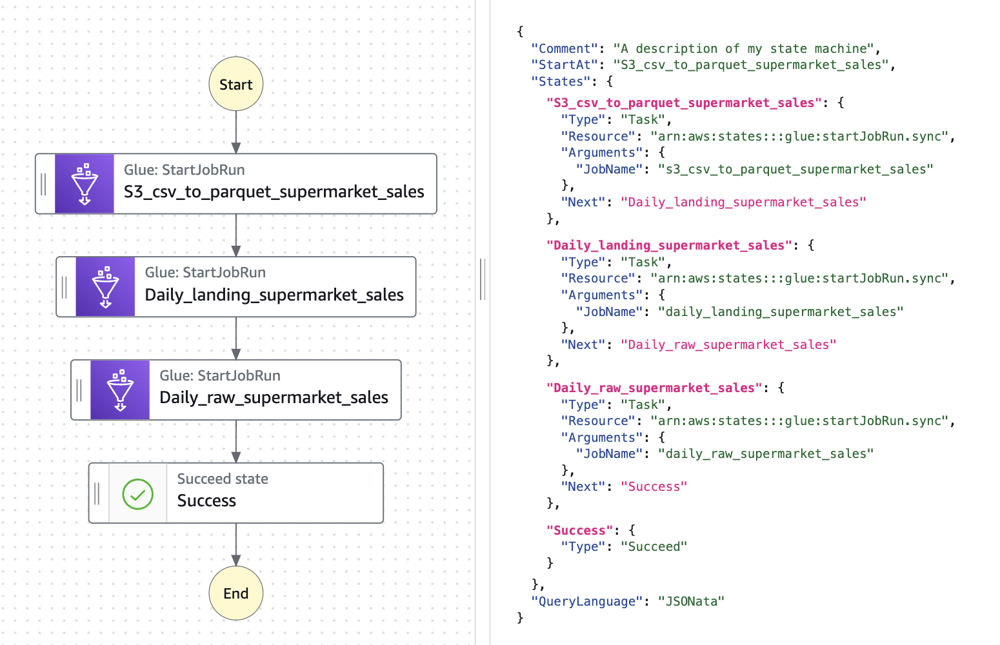

- Step function run success
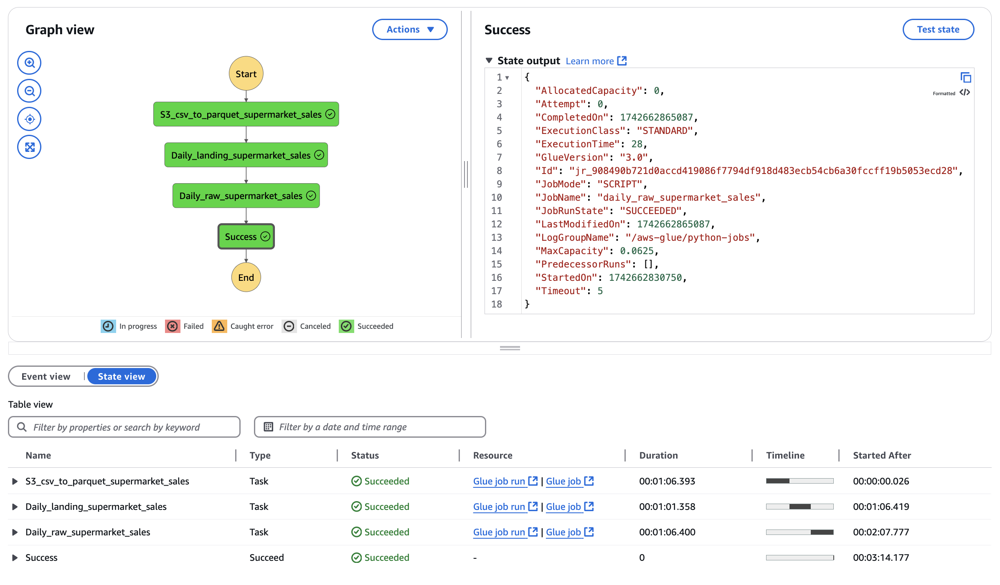
- Schedule with **Amazon EventBridge Scheduler** (e.g., daily at 7 AM)
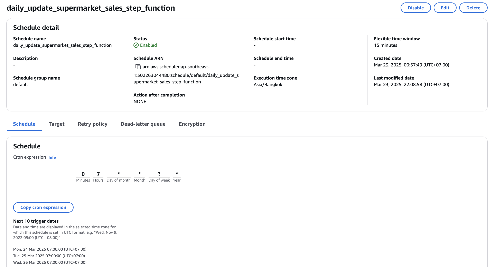
- Monitor logs with **CloudWatch**.
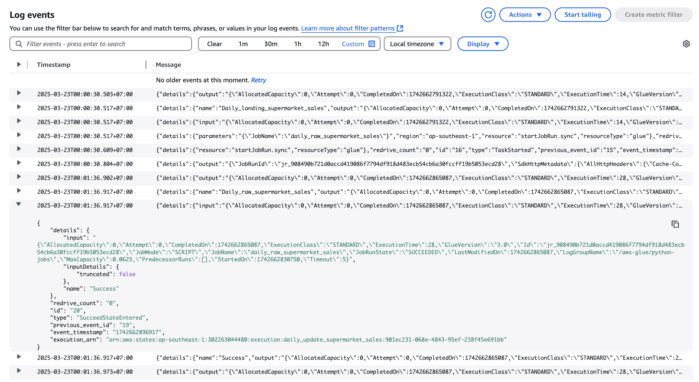

### Data Visualization
- **AWS QuickSight**: Used for visualizing data from the `serving_zone` in Athena, enabling business insights through interactive dashboards
- **Dashboards Created**:
  - **Branch Sales Ranking**: Ranks branches by total sales volume
  - **Best-Selling Products**: Identifies top-performing products by sales quantity
  - **Top 5 Customers by Total Purchase Amount**: Highlights the highest-spending customers
  - **Total Sales by Product Category**: Aggregates sales across product categories
  - **Product Price vs Margin(%)**: Analyzes price against profit margin to identify highest profit contributors
- **Example**: Supermarket Sales Report
  - Screenshot: 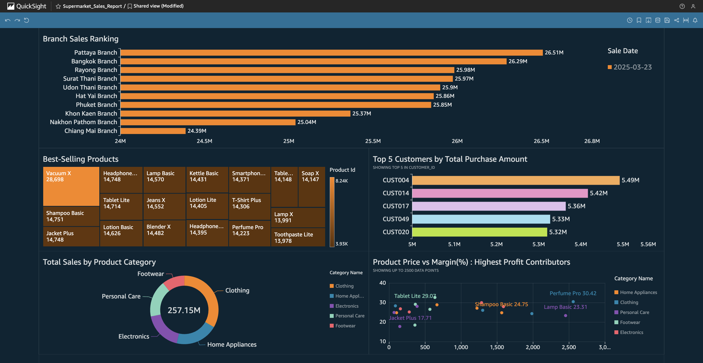
- **Purpose**: Transforms raw data into actionable insights, such as sales trends, profit margins, and customer behavior, for data analysts and business users

## Summary: Benefits of Parquet Conversion and Partitioning

This summary highlights three key outcomes from the serverless datalake project, based on file conversion and query performance in Athena.

### 1. File Conversion: CSV to Parquet
- **CSV Size**: 636.7 MB
- **Parquet Size**: 91.3 MB
- **Reduction**: 
  - Absolute: 636.7 MB - 91.3 MB = **545.4 MB**
  - Percentage: (545.4 / 636.7) * 100 = **85.66%**
- **Conclusion**: Converting CSV to Parquet reduces storage size by **85.66%**, saving significant space and costs in S3

### 2. Data Scanned: Partitioned vs. Non-Partitioned
- **Non-Partitioned Query**:
  - Query: `SELECT * FROM "supermarket_raw_zone"."supermarket_sales" WHERE sale_date = '2024-11-19'`
  - File: 10M rows, 91.3 MB (Parquet), covering 2024-09-01 to 2024-12-31 (122 days)
  - Results: 81,793 rows
  - Data Scanned: **99.64 MB**
  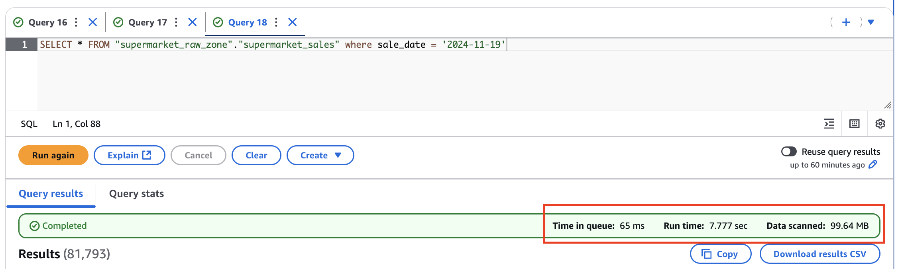
- **Partitioned Query**:
  - Query: `SELECT * FROM "supermarket_raw_zone"."supermarket_sales" WHERE sale_date = '2025-03-23'`
  - File: 81,967 rows, 696.4 KB (Parquet), covering 2025-03-23 (1 day)
  - Results: 81,967 rows
  - Data Scanned: **694.93 KB** (~0.695 MB)
- **Reduction**:
  - Absolute: 99.64 MB - 0.695 MB = **98.945 MB**
  - Percentage: (98.945 / 99.64) * 100 = **99.3%**
  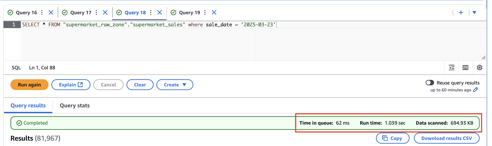
- **Conclusion**: Partitioning reduces data scanned by **99.3%** (from 99.64 MB to 694.93 KB), as Athena scans only the relevant partition instead of the entire file

### 3. Run Time: Partitioned vs Non-Partitioned
- **Non-Partitioned**:
  - Run Time: **7.777 seconds**
  - Time in Queue: 65 ms
- **Partitioned**:
  - Run Time: **1.039 seconds**
  - Time in Queue: 62 ms
- **Reduction**:
  - Absolute: 7.777 s - 1.039 s = **6.738 seconds**
  - Percentage: (6.738 / 7.777) * 100 = **86.64%**
- **Conclusion**: Partitioning cuts run time by **86.64%** (from 7.777 s to 1.039 s), driven by the drastic reduction in data scanned, despite similar queue times

### Final Takeaway
- Converting to Parquet saves **85.66%** of storage.
- Partitioning slashes data scanned by **99.3%** and run time by **86.64%**, proving its value for cost-efficiency and performance in this datalake
- These optimizations enable scalable, cost-effective querying as data grows